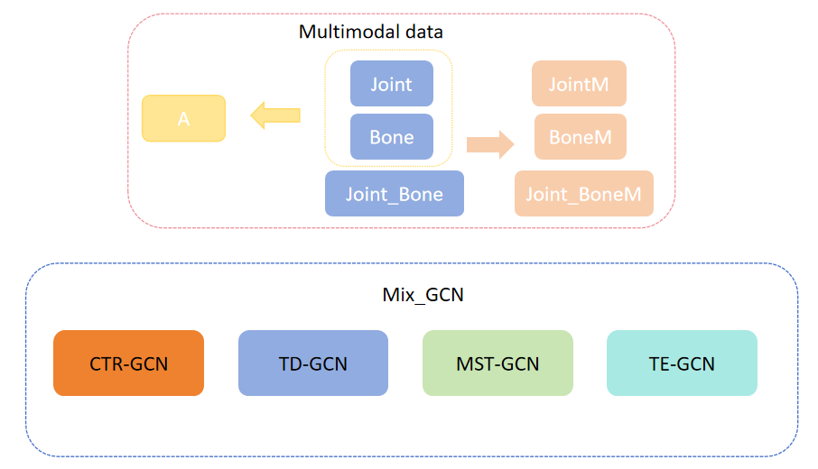
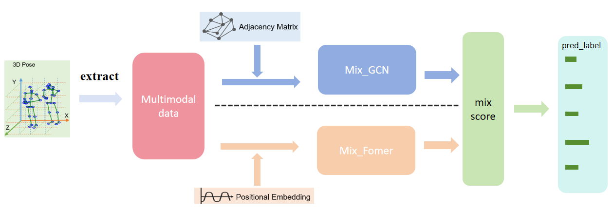
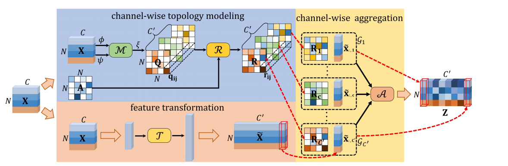
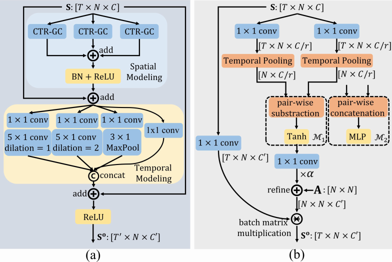
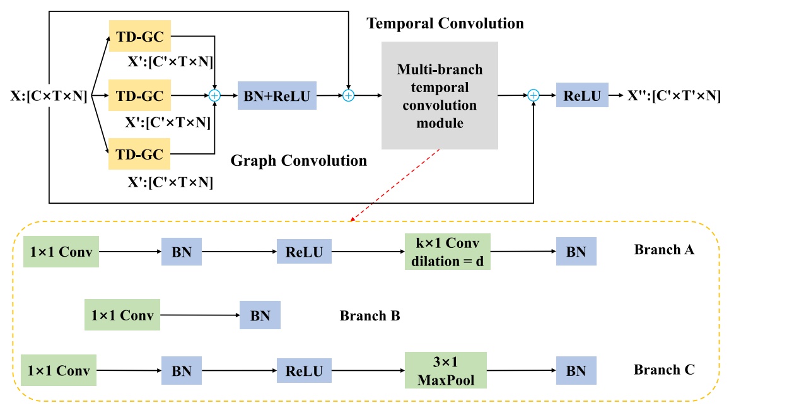
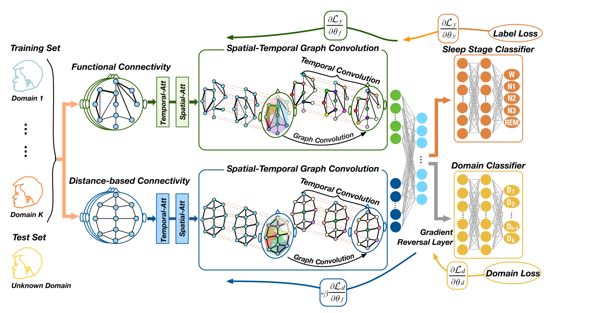
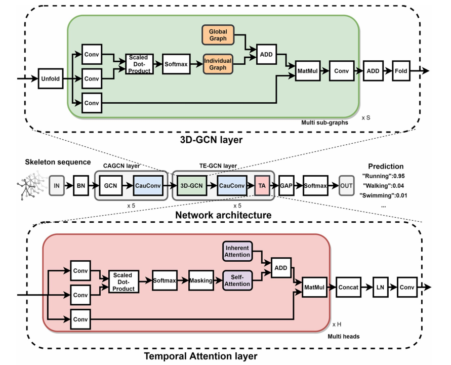

# new_HDBN
队伍：小飞棍爱cv

# 一、文档说明与消融实验
## 模型简述
**我们对```HDBN模型```进行了改进创新，来自论文"[HDBN: A Novel Hybrid Dual-branch Network for Robust Skeleton-based Action Recognition](https://arxiv.org/abs/2404.15719)"，仓库地址为```https://github.com/liujf69/ICMEW2024-Track10/blob/main```**<br />
**模型概述如下：**<br />


**我们的创新点在于：**<br />
**1、使用多模态数据进行训练与融合，提高模型的泛化能力。**<br />
**2、使用Joint和Bone模态数据生成Angle数据模态参与训练，提高数据的特征表现**<br />
**3、利用不同的网络结构实现基于骨架的鲁棒动作识别，充分利用不同骨干网之间的结构互补性,有效地结合了GCNs和变压器。将骨架数据输入到GCN和Transformer主干中进行高级特征建模，并通过后期融合策略将其有效结合，实现更稳健的基于骨架的动作识别。**<br />
**4、通过新的算法搜索权重，找寻模型融合的最优参数，从而获得更好的模型效果。**
## 细节阐述
**1、CTR_GCN模型**<br />
**模块构成：**<br />
1.特征变换模块:将输入特征变换为高层特征。<br />
2.通道拓扑建模模块:动态地学习通道拓扑结构。<br />
3.通道聚合模块:对每个通道的特征进行聚合。<br />
4.空间建模模块:利用多个CTR-GC并行提取关节之间的相关性，并将结果汇总作为输出。<br />
5.时间建模模块:使用多尺度时间卷积来建模不同持续时间的动作。<br />


<br />
**2、TD_GCN模型**<br />
**模块构成：**<br />
1.耦合特征学习(CFL)模块：从输入骨架序列中提取高层时空特征。CFL模块使用1×1卷积操作来提取高层时空特征，并保留通道和时间信息。<br />
2.通道解耦学习(CDL)模块：计算通道依赖的邻接矩阵D。CDL模块根据预定义的邻接矩阵A和通道特定的相关矩阵Q，计算通道依赖的邻接矩阵D。<br />
3.时间解耦学习(TDL)模块：计算时间依赖的邻接矩阵H。TDL模块通过自对偶减法操作来计算不同时间帧关节特征之间的差异，并生成时间依赖的邻接矩阵H。<br />
4.时间通道融合(TCF)模块：融合来自通道和时间维度的节点特征信息。TCF模块使用一个融合函数F来融合来自通道和时间维度的节点特征信息。<br />

<br />
**3、MST_GCN模型**<br />
**模块构成：**<br />
1.多视图模块：通过构建两种不同的视图（基于功能连接的视图和基于空间距离的图）来更全面地表示空间信息。<br />
2.空间-时间注意力模块：用于自动提取最相关的空间和时间信息。<br />
3.空间-时间图卷积模块：结合了空间图卷积和标准时间卷积来提取空间和时间特征。<br />
4.领域泛化模块：减少个体差异对模型性能的影响，使用对抗性领域泛化方法来提取特征。<br />

<br />
**4、TE_GCN模型**<br />
**模块构成：**<br />
1.因果卷积层: 确保在每个时间步长上没有未来信息泄露，以保留输入的顺序信息。<br />
2.跨时空图卷积层 (3D-GCN): 将自适应图从空间域扩展到时间域，以捕捉关节之间的局部跨时空依赖关系。<br />
3.时间注意力层: 增强远程时间依赖的建模能力，帮助网络直接关注重要的时间步长。<br />
时间注意力层 (Temporal Attention Layer): 时间注意力用红色块表示，位于网络结构的底部，用于捕捉远程时间依赖关系。<br />
因果卷积层 (Causal Convolution Layer): 中间部分的蓝色块也代表了因果卷积层，用于确保没有未来信息泄露。<br />
跨时空图卷积层 (3D-GCN): 跨时空图卷积层位于网络结构的顶部，用绿色块表示。<br />

## 消融实验
本实验旨在验证所提出方法的有效性，通过对比不同网络模型和数据集融合的效果，展示模型性能的提升。所有实验均基于Trian训练集进行训练，并在Val测试集上计算准确率。<br />
### 网络模型融合实验
我们进行了消融实验，以评估不同网络模型融合对模型性能的影响。实验结果如表一所示，其中打勾表示采用了该网络模型。当多个网络模型同时采用时，我们对每个网络模型的权重进行平均融合。<br />
### 单个网络模型性能
我们发现，仅采用单个网络模型时，模型的准确率大约为46%<br />
### MixGCN模型性能
将TDGCN、CTRGCN、TEGCN、MSTGCN四个GCN模型结合起来，形成MixGCN模型，准确率提升至48.45%，相较于单个GCN网络提升了2%。<br />
### MixFormer与MixGCN融合
进一步将MixFormer与MixGCN相融合，最终模型的准确率达到48.9%，相较于单独的MixFormer和MixGCN提升了0.5%-2%。<br />
### 表1：不同网络模型的融合
| TDGCN | CTRGCN | TEGCN | MSTGCN | MixFormer |  ACC(%)  |
|:-----:|:------:|:-----:|:------:|:---------:|:--------:|
|   √   |   -    |   -   |   -    |     -     |   46.9   |
|   -   |   √    |   -   |   -    |     -     |   45.4   |
|   -   |   -    |   √   |   -    |     -     |  46.25   |
|   -   |   -    |   -   |   √    |     -     |   45.6   |
|   -   |   -    |   -   |   -    |     √     |   46.8   |
|   √     |    √     |   √     |    √     |     -     |  48.45   |
|   √     |    √     |   √     |    √     |     √       | **48.9** |

### 数据集融合实验
我们还对单个模型在不同数据集之间的融合进行了实验。实验结果如表二所示，其中打勾表示采用了该数据集，红色字体的JointBoneMotion和Angle为我们自己所提出的数据集。所有数据集均基于TDGCN模型。<br />
### 单个数据集性能：
仅使用单个数据集时，Joint、Bone、JointBone三个数据集的准确率较其他数据集高约10%。<br />
### JointBoneMotion和Angle数据集：
我们提出的JointBoneMotion数据集和Angle数据集相较于JointMotion、Bonemotion的准确率更高。<br />
### Angle数据集融合：
将包含Motion的三个数据集进行融合，准确率提升幅度不大。而将Angle数据集融合到其中，准确率提升至41.3%，相较于原先的37.55%提升了4%。<br />
### Joint、Bone、JointBone数据集融合：
将这三个数据集进行融合，准确率可达46.85%，较单个数据集提升了2.5%以上。<br />
### 所有数据集融合：
将所有7个数据集进行融合，准确率可达46.9%，比仅融合单个数据集提升了3%左右。<br />
### 表二：在TD_GCN模型上不同数据集的融合
| Joint  | Bone  | JointBone  |  JointMotion   |  Bonemotion   | JointBoneMotion  | Angle | ACC(%) |
|:------:|:-----:|:----------:|:--------------:|:-------------:|:----------------:|:-----:|:------:|
|   √    |   -   |     -      |       -        |       -       |        -         |   -   |  44.2  |
|   -    |   √   |     -      |       -        |       -       |        -         |   -   |  43.8  |
|   -    |   -   |     √      |       -        |       -       |        -         |   -   |  44.0  |
|   -    |   -   |     -      |       √        |       -       |        -         |   -   | 34.05  |
|   -    |   -   |     -      |       -        |       √       |        -         |   -   |  35.6  |
|   -    |   -   |     -      |       -        |       -       |        √         |   -   |  35.8  |
|   -    |   -   |     -      |       -        |       -       |        -         |   √   |  36.7  |
|   √    |   √   |     √      |       -        |       -       |        -         |   -   | 46.85  |
|   -    |   -   |     -      |       √        |       √       |        -         |   -   | 36.75  |
|   -    |   -   |     -      |       √        |       √       |        √         | - |37.55  |
|   -    |   -   |     -      |       √        |       √       |        √         |   √   |  41.3  |
|    √     |   √     |      √       |        √         |       √         |         √          |   √   |  **46.9**  |
## 总结
**通过对比不同网络模型和数据集的融合实验，我们发现模型性能随着网络模型和数据集的融合而显著提升。**<br />
**特别是MixGCN和MixFormer的融合，以及Angle数据集和JointBoneMotion数据集的引入，对模型准确率的提升起到了关键作用。这些结果表明，所提出的方法能够有效地提高模型的准确率，验证了其优越性。**<br />
# 二、复现过程  

## 训练日志
**我们的训练日志在各个模型文件夹的```log_dir```文件夹内。**<br />
**！！！后续模型复现可以根据对应log文件进行config配置！！！**
## mix_data
**我们的各模态pred文件在：通过网盘分享的文件：mix_data.zip
链接: https://pan.baidu.com/s/1IdcwAAx37jtD28zm5ueA4g 提取码: 5exf 
--来自百度网盘超级会员v3的分享**
## all_pt
**我们的各模型的pt文件在：通过网盘分享的文件：all_pt
链接: https://pan.baidu.com/s/1qrPQp2X8E0N_dJJtffxkYw 提取码: gu2j 
--来自百度网盘超级会员v3的分享**

##  运行mix获取融合后的pred.npy文件
**先检查34个pkl置信度文件是否都移动到```mix_data```文件夹下，然后直接运行以下代码即可获得```pred.npy```**
**mix_A2.py生成val数据集的pred文件**
```angular2html
python mix_A2.py

#正确率：0.5025
```

**mix_B2.py生成test数据集的pred文件**
```angular2html
python mix_B2.py

#正确率：未知
```
# 三、详细过程复现
## 数据集导入
**请自备train与test数据集**<br />
**生成Angle数据集：进入new_A文件夹，运行```python gen_angle_data.py```即可。**
**因为每个人负责不同的模型，数据放置位置没有统一固定，情况不同，复现具体模型时需要按照各模型的yaml文件放置数据集位置**<br />
**如果还需要重新训练，也要下载测试集val按照同样的方法进行放置。**<br />
**以CTR_GCN模型的yaml文件为例进行数据集位置放置：**
```angular2html
#以CTR_GCN为例：
-- CTR_GCN
    -- dataset
        -- feeder_JB.py
        -- feeder_xyz.py
        -- tools.py
        -- save_3d_pose
            -- train_joint.npy
            -- train_bone.npy
            -- train_joint_bone.npy
            -- train_label.npy
            -- test_joint.npy
            -- test_bone.npy
            -- test_joint_bone.npy
            -- test_label.npy
            ......

#其余数据集放置方法和位置可能不同，请按照具体模型的config文件更改
```
# 运行获取CTR、TD、TE的置信度文件
## 1、运行获取CTR_GCN的各模态的置信度文件
### 1.1、CTR_GCN环境配置
首先进入```CTR_GCN```文件夹目录下，根据CTR_GCN.yml配置相关环境，然后在```CTR_GCN```文件夹目录下运行以下命令，安装需要额外导入的一个包：
```
pip install -e torchlight
```
### 1.2、根据```config```目录下的各yaml文件调整和放置data、label文件的位置<br />
**!!!重要：原config文件路径写的什么模态的，就用哪一模态的**<br />
**例如CTR_B.yaml中路径写的joint.npy，就是用joint.npy数据集，而不是bone数据集，因为CTR_B.yaml运用的内置转化将join转化为bone，而不是输入的bone**
### 1.3、运行以下代码获得pkl置信度文件：
```
python main.py --config ./config/ctrgcn_J.yaml --phase test --save-score True --weights ./checkpoints/ctr_j.pt --device 0
python main.py --config ./config/ctrgcn_B.yaml --phase test --save-score True --weights ./checkpoints/ctr_b.pt --device 0
python main.py --config ./config/ctrgcn_JB.yaml --phase test --save-score True --weights ./checkpoints/ctr_jb.pt --device 0
python main.py --config ./config/ctrgcn_JM.yaml --phase test --save-score True --weights ./checkpoints/ctr_jm.pt --device 0
python main.py --config ./config/ctrgcn_BM.yaml --phase test --save-score True --weights ./checkpoints/ctr_bm.pt --device 0
python main.py --config ./config/ctrgcn_JBM.yaml --phase test --save-score True --weights ./checkpoints/ctr_jbm.pt --device 0
python main.py --config ./config/ctrgcn_A.yaml --phase test --save-score True --weights ./checkpoints/ctr_A.pt --device 0
```
**！！！重要**<br />
**如果出现以下报错：**
```
Traceback (most recent call last):
  File "/root/autodl-tmp/复现说明文档/CTR_GCN/main.py", line 27, in <module>
    from torchlight import DictAction
  File "/root/autodl-tmp/复现说明文档/CTR_GCN/torchlight/torchlight/__init__.py", line 1, in <module>
    from .util import IO
  File "/root/autodl-tmp/复现说明文档/CTR_GCN/torchlight/torchlight/util.py", line 16, in <module>
    from torchpack.runner.hooks import PaviLogger
  File "/root/autodl-tmp/miniconda3/envs/mix/lib/python3.10/site-packages/torchpack/__init__.py", line 1, in <module>
    from .config import *
  File "/root/autodl-tmp/miniconda3/envs/mix/lib/python3.10/site-packages/torchpack/config.py", line 4, in <module>
    from collections import Iterable
ImportError: cannot import name 'Iterable' from 'collections' (/root/autodl-tmp/miniconda3/envs/mix/lib/python3.10/collections/__init__.py)
```
**则需要进入具体的环境中去修改文件，我需要修改的位置为```miniconda3/envs/mix/lib/python3.10/site-packages/torchpack```的```config.py```文件，将开头的导入包：```from collections import Iterable```进行修改：**
```angular2html
#原config.py

from collections import Iterable
```
**改为：**
```
#修改后的config.py

from collections.abc import Iterable
```
**然后重新运行命令进行测试**
### 1.4、移动pkl置信度文件
**进入```output```文件夹下，将各文件夹下的置信度文件：```ctr_J.pkl、ctr_B.pkl、ctr_JB.pkl```转移到根文件夹下的```all_mix_pred_data```文件夹下，后面融合时会用到。**                                                                                                                  
## 2、运行获取TD_GCN的j、b、jb模态的置信度文件
### 2.1、首先进入```TD_GCN```文件夹目录下，运行以下命令，安装需要额外导入的一个包：
```
pip install -e torchlight
```
**然后根据```config```目录下的各yaml文件调整和放置data、label文件的位置，调整输出文件夹位置**

### 2.2、运行以下代码获得npy置信度文件：
**！！！如果有错可以根据对应log文件进行config配置！！！**
```
#需要注意的是TD_GCN的输出在work_dir文件夹下，运行一次测试会将上一次的结果覆盖，
#所以需要运行一行移出一次置信度文件`epoch1_test_score.npy`并手动修改文件名

python main_td.py --device 0 --config config/TDGCN_joint.yaml --phase test --save-score True --weights ./checkpoints/td_j.pt
python main_td.py --device 0 --config config/TDGCN_bone.yaml --phase test --save-score True --weights ./checkpoints/td_b.pt
python main_td.py --device 0 --config config/TDGCN_joint_bone.yaml --phase test --save-score True --weights ./checkpoints/td_jb.pt
python main_td.py --device 0 --config config/TDGCN_jm.yaml --phase test --save-score True --weights ./checkpoints/td_jm.pt
python main_td.py --device 0 --config config/TDGCN_bm.yaml --phase test --save-score True --weights ./checkpoints/td_bm.pt
python main_td.py --device 0 --config config/TDGCN_jbm.yaml --phase test --save-score True --weights ./checkpoints/td_jbm.pt
python main_td.py --device 0 --config config/TDGCN_A.yaml --phase test --save-score True --weights ./checkpoints/td_A.pt
```
### 2.3、移动pkl置信度文件
**进入输出的```work_dir```文件夹下，将各文件夹下的置信度文件```epoch1_test_score.npy```手动修改文件名，转移到根文件夹下的```all_mix_pred_data```文件夹下，后面融合时会用到。**  
## 3、运行获取MST_GCN的各模态的置信度文件
### 3.1、首先进入```MST_GCN```文件夹目录下，运行以下命令，安装需要额外导入的一个包：
```
pip install -e torchlight
```
**然后根据```config```目录下的各yaml文件调整和放置data、label文件的位置，调整输出文件夹位置**

### 3.2、运行以下代码获得npy置信度文件：
**！！！如果有错可以根据对应log文件进行config配置！！！**
```
#需要注意的是mst_GCN的输出在work_dir文件夹下，运行一次测试会将上一次的结果覆盖，
#所以需要运行一行移出一次置信度文件`epoch1_test_score.npy`并手动修改文件名

python main.py --device 0 --config config/MSTGCN_joint.yaml --phase test --save-score True --weights ./checkpoints/mst_j.pt
python main.py --device 0 --config config/MSTGCN_bone.yaml --phase test --save-score True --weights ./checkpoints/mst_b.pt
python main.py --device 0 --config config/MSTGCN_joint_bone.yaml --phase test --save-score True --weights ./checkpoints/mst_jb.pt
python main.py --device 0 --config config/MSTGCN_jm.yaml --phase test --save-score True --weights ./checkpoints/mst_jm.pt
python main.py --device 0 --config config/MSTGCN_bm.yaml --phase test --save-score True --weights ./checkpoints/mst_bm.pt
python main.py --device 0 --config config/MSTGCN_jbm.yaml --phase test --save-score True --weights ./checkpoints/mst_jbm.pt
python main.py --device 0 --config config/MSTGCN_A.yaml --phase test --save-score True --weights ./checkpoints/mst_A.pt
```
### 3.3、移动pkl置信度文件
**进入输出的```work_dir```文件夹下，将各文件夹下的置信度文件```epoch1_test_score.npy```手动修改文件名，转移到根文件夹下的```all_mix_pred_data```文件夹下，后面融合时会用到。**  


## 4、运行获取TE_GCN的各模态的置信度文件
### 4.1、根据```config```目录下的各yaml文件调整和放置data、label文件的位置，调整输出文件夹位置
### 4.2、运行以下代码获得npy置信度文件：
**！！！如果有错可以根据对应log文件进行config配置！！！**
```
#因为模型读取问题，只能将pt文件这样命名：
#1-1-1.pt为te_j.pt，2-2-2.pt为te_b.pt，3-3-3.pt为te_jb.pt
#同时需要注意的是TE_GCN的输出在work_dir文件夹下，运行一次测试会将上一次的结果覆盖，
#所以需要运行一行移出一次置信度文件`epoch1_test_score.npy`并手动修改文件名

python main.py --device 0 --config config/TEGCN_joint.yaml --phase test --save-score True --weights ./checkpoints/1-1-1.pt
python main.py --device 0 --config config/TEGCN_bone.yaml --phase test --save-score True --weights ./checkpoints/2-2-2.pt
python main.py --device 0 --config config/TEGCN_joint_bone.yaml --phase test --save-score True --weights ./checkpoints/3-3-3.pt
python main.py --device 0 --config config/TEGCN_jm.yaml --phase test --save-score True --weights ./checkpoints/4-4-4.pt
python main.py --device 0 --config config/TEGCN_bm.yaml --phase test --save-score True --weights ./checkpoints/5-5-5.pt
python main.py --device 0 --config config/TEGCN_jbm.yaml --phase test --save-score True --weights ./checkpoints/6-6-6.pt
python main.py --device 0 --config config/TEGCN_A.yaml --phase test --save-score True --weights ./checkpoints/7-7-7.pt
```
### 4.3、移动npy置信度文件
**进入输出的文件夹下，将各文件夹下的置信度文件转移到根文件夹下的```all_mix_pred_data```文件夹下，后面融合时会用到。**  

## 5、运行获取Mix_Former的各模态的置信度文件
### 5.1、根据```config```目录下的各yaml文件调整和放置data、label文件的位置，调整输出文件夹位置
**然后运行以下代码：****！！！如果有错可以根据对应log文件进行config配置！！！**
```angular2html
python main.py --config ./config/mixformer_V2_J.yaml --phase test --save-score True --weights ./checkpoints/former_j.pt --device 0  
python main.py --config ./config/mixformer_V2_B.yaml --phase test --save-score True --weights ./checkpoints/former_b.pt --device 0 
python main.py --config ./config/mixformer_V2_JM.yaml --phase test --save-score True --weights ./checkpoints/former_jm.pt --device 0 
python main.py --config ./config/mixformer_V2_BM.yaml --phase test --save-score True --weights ./checkpoints/former_bm.pt --device 0 
python main.py --config ./config/mixformer_V2_k2.yaml --phase test --save-score True --weights ./checkpoints/former_k2.pt --device 0 
python main.py --config ./config/mixformer_V2_k2M.yaml --phase test --save-score True --weights ./checkpoints/former_k2m.pt --device 0 
```
### 5.2、移动npy置信度文件
**进入输出的文件夹下，将各文件夹下的置信度文件转移到根文件夹下的```all_mix_pred_data```文件夹下，后面融合时会用到。**  


## 验证训练过程

**如需要重新验证训练过程，请下载测试集A，按照上述数据集导入方法进行放置，同时更改yaml文件。**<br />
```angular2html
cd CTR_GCN
python main.py --config ./config/ctrgcn_J.yaml --device 0
python main.py --config ./config/ctrgcn_B.yaml --device 0
python main.py --config ./config/ctrgcn_JB.yaml --device 0
python main.py --config ./config/ctrgcn_JM.yaml --device 0
python main.py --config ./config/ctrgcn_BM.yaml --device 0
python main.py --config ./config/ctrgcn_JBM.yaml --device 0
python main.py --config ./config/ctrgcn_A.yaml --device 0

cd TD_GCN
python main_td.py --device 0 --config config/TDGCN_joint.yaml
python main_td.py --device 0 --config config/TDGCN_bone.yaml
python main_td.py --device 0 --config config/TDGCN_joint_bone.yaml
python main_td.py --device 0 --config config/TDGCN_jm.yaml
python main_td.py --device 0 --config config/TDGCN_bm.yaml
python main_td.py --device 0 --config config/TDGCN_jbm.yaml
python main_td.py --device 0 --config config/TDGCN_A.yaml

cd MST_GCN
python main.py --device 0 --config config/MSTGCN_joint.yaml
python main.py --device 0 --config config/MSTGCN_bone.yaml
python main.py --device 0 --config config/MSTGCN_joint_bone.yaml
python main.py --device 0 --config config/MSTGCN_joint_motion.yaml
python main.py --device 0 --config config/MSTGCN_bone_motion.yaml
python main.py --device 0 --config config/MSTGCN_joint_bone_motion.yaml
python main.py --device 0 --config config/MSTGCN_A.yaml

cd TE_GCN
python main.py --device 0 --config config/TEGCN_joint.yaml
python main.py --device 0 --config config/TEGCN_bone.yaml
python main.py --device 0 --config config/TEGCN_joint_bone.yaml
python main.py --device 0 --config config/TEGCN_jm.yaml
python main.py --device 0 --config config/TEGCN_bm.yaml
python main.py --device 0 --config config/TEGCN_jbm.yaml
python main.py --device 0 --config config/TEGCN_A.yaml

cd Mix_Former
python main.py --config ./config/mixformer_V2_J.yaml --device 0
python main.py --config ./config/mixformer_V2_B.yaml --device 0
python main.py --config ./config/mixformer_V2_k2.yaml --device 0
python main.py --config ./config/mixformer_V2_JM.yaml --device 0
python main.py --config ./config/mixformer_V2_BM.yaml --device 0
python main.py --config ./config/mixformer_V2_k2M.yaml --device 0


```
